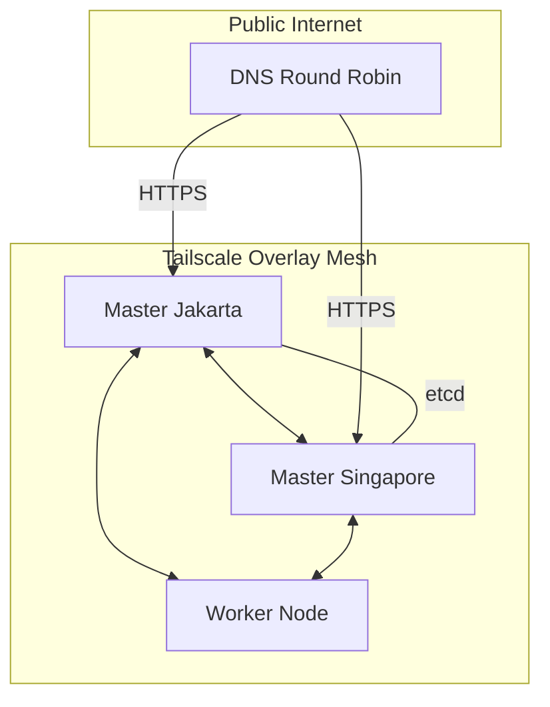

# 🚀 SumoPod HA Kubernetes Fleet


Automated deployment and management of a **Multi-Master High-Availability (HA) Kubernetes Cluster** using K3s, secured with a Tailscale WireGuard mesh and hardened with automated firewall configuration.

---

## ✨ Key Features

*   **🏆 Multi-Master HA**: Redundant Control Plane with clustered `etcd` for zero-downtime management.
*   **🔄 Fresh Image Ready**: Fully automated setup proven to work from scratch on empty server images.
*   **🛡️ Tailscale Mesh**: Secure, encrypted inter-node communication over a private WireGuard overlay.
*   **🔒 Security Hardened**: Automated `firewalld`/`ufw` configuration applied post-deployment.
*   **📜 Automated SSL**: Integrated `cert-manager` with Let's Encrypt for automatic HTTPS.
*   **🛠️ Modular Ansible**: Version-controlled software and centralized network CIDR management.
*   **🔐 Secret Encryption**: Kubeconfigs are encrypted via **Mozilla SOPS** and **Age**.

---

## 🏗️ Architecture



| Component | Technology |
| :--- | :--- |
| **Orchestration** | K3s (Lightweight Kubernetes) |
| **Networking** | Tailscale (WireGuard) |
| **Ingress** | Traefik |
| **Certs** | cert-manager + Let's Encrypt |
| **Automation** | Ansible (WSL Debian compatible) |

---

## 🚀 Getting Started

### 1️⃣ Prerequisites
*   **Local**: Windows with WSL2 (Debian) or Linux.
*   **Tools**: `ansible`, `sops`, `age`, `kubectl`.
*   **Secrets**: An authentication key from Tailscale (Reusable & Ephemeral recommended).

### 2️⃣ Configuration
Copy the template and fill in your server details:
```bash
cp .env.template .env
# Edit .env with your IPs, Passwords, and Tailscale Key
```

### 3️⃣ Deployment
Run the full automated setup via Ansible:
```bash
# Using the provided WSL helper command
wsl -d Debian bash -c "set -a && source .env && set +a && cd ansible && ansible-playbook -i inventory/dynamic_env.py site.yml"
```

---

## 📂 Repository Structure

*   `ansible/` - Core automation logic.
    *   `roles/` - Reusable configuration modules (Tailscale, K3s, Firewall).
    *   `group_vars/` - Centralized version and network management.
    *   `kubeconfigs/` - SOPS-encrypted cluster access files.
*   `docs/` - Detailed guides (see below).

---

## 📖 Documentation

| Guide | Description |
| :--- | :--- |
| [🌐 Server Config](./SERVER_CONFIGURATION.md) | Detailed fleet status and network history. |
| [🔑 Access Guide](./KUBERNETES_ACCESS.md) | How to decrypt kubeconfig and use `kubectl`. |
| [🐧 WSL Debian Guide](./ANSIBLE_WSL_GUIDE.md) | Setup and troubleshooting for Windows users. |
| [📈 Progress Log](./progress.log) | Latest deployment milestones and status. |

---

## 🛠️ Management Commands

**Update Tailscale Version:**
Modify `ansible/group_vars/all.yml` and re-run the playbook. The roles will automatically detect the version change and update the binaries.

**Add New Workers:**
Simply add `SERVER_PUBLIC_IP_ADDRESS_N` and `SERVER_ROLE_N` to your `.env` and execute Ansible.

---

## 🤝 Contributing
Feel free to open issues or submit PRs for security hardening or feature enhancements.

## 📄 License
This project is for internal server management. All rights reserved.
